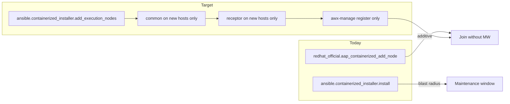

# Installer migration plan (`ansible.containerized_installer.add_execution_nodes`)

**Authoritative porting spec** for folding additive execution/hop node join from this collection
into the **containerized installer** (`ansible.containerized_installer`).

| | |
|--|--|
| **Reference implementation** | This repo — `playbooks/add_node.yml` and `roles/*` |
| **Target playbook** | `ansible.containerized_installer.add_execution_nodes` |
| **Scope** | Containerized AAP **2.7** first, then **2.6** backport |
| **Out of scope** | RPM installer, OpenShift/operator, AAP 2.5 and earlier |

Related: [docs/ARCHITECTURE.md](docs/ARCHITECTURE.md), [docs/COLLECTION_MAP.md](docs/COLLECTION_MAP.md),
[docs/FINDINGS.md](docs/FINDINGS.md), [TEST.md](TEST.md), [`.sdlc/adrs/README.md`](.sdlc/adrs/README.md).

---

## Agent maintenance contract

**All AI agents MUST keep this file current.** It is the single handoff document for a future
installer implementation. Do not rely on vendored installer trees or external repo paths in this
plan — those change per release train.

### Update this plan when you change

| Trigger | What to update in this file |
|---------|----------------------------|
| `playbooks/add_node.yml` play order or gates | § Play order, § Playbook structure |
| Any `roles/*` join logic (discover, register, mesh, listener, verify) | § Role porting map, § Behavioural spec |
| New/changed `aap_add_node_*` or installer `add_execution_nodes_*` variables | § Variable mapping |
| ADR affecting join (dial direction, serial, preflight, role reuse) | § ADR alignment |
| New lab scenario or pass criteria | § Validation |
| Resolved open item or new known gap | § Open items |
| Collection feature intentionally **not** ported | § Out of scope for installer |

### Update procedure

1. Edit the affected section(s) in the same PR as the code change (or a docs-only follow-up in the same branch).
2. Bump **Plan revision** at the bottom of this file.
3. If behaviour is architectural, add or reference an ADR — do not encode policy only in this plan.

### Do not put in this plan

- Paths to upstream installer git repos, branches, or clone locations
- Vendored snapshot directories (none are required to understand the port)
- Lab hostnames, IPs, or secrets

---

## Thesis

Almost all join mechanics already exist in `ansible.containerized_installer` (`common`, `receptor`,
controller `init.yml` registration). This collection exists because **orchestration is missing**:
there is no first-class playbook that runs **only** the EN/HN growth path.

Migration is a **thin additive playbook** plus **small task extractions** — not a rewrite of
receptor, TLS, image load, or `awx-manage`.



---

## Problem and goal

### Today (full install hazard)

1. Admin adds hosts under `[execution_nodes]` in the containerized installer inventory.
2. Admin re-runs full install: `ansible-playbook -i inventory ansible.containerized_installer.install`
3. The playbook walks the **entire** platform; config rewrites notify restarts across the stack.
4. Controller `init` can run migrate/provision/**deprovision** for DB hostnames missing from inventory.

### Goal (additive playbook)

Ship `ansible.containerized_installer.add_execution_nodes` that:

- Targets **net-new** or **incomplete** hosts only (heartbeat-based discovery)
- Defaults to **outbound peer dial** (`receptor_peers` on new nodes) — existing `receptor.conf` untouched
- Reuses the **existing mesh CA** (no cluster CA regeneration)
- Runs `awx-manage` registration **without** full controller init or inventory-diff deprovision
- Avoids restarting gateway / controller / hub / EDA / redis (except optional AIO listener flip)

### Admin commands

| Mode | Command |
|------|---------|
| Greenfield (unchanged) | `ansible-playbook -i inventory ansible.containerized_installer.install` |
| Additive (target) | `ansible-playbook -i inventory ansible.containerized_installer.add_execution_nodes` |

Invoke by **collection FQCN** (same as `install`). Do not assume file-path playbook execution
without the collection on `ANSIBLE_COLLECTIONS_PATH`.

---

## Playbook structure

Mirror `playbooks/add_node.yml` in the installer collection. Suggested installer artifacts:

| Artifact | Purpose |
|----------|---------|
| `playbooks/add_execution_nodes.yml` | Additive join orchestration |
| `roles/add_execution_nodes/` | Growth-only tasks (preflight, discover, mesh fetch, register wrapper, verify) |
| `roles/automationcontroller/tasks/register_execution_nodes.yml` | Thin include of shared registration tasks (optional; see § Required installer changes) |

### Play order

| Step | Collection source | Installer target | Hosts | Notes |
|------|-------------------|------------------|-------|-------|
| 1 | `validate_setup_dir` | **Omit** or minimal inventory assert | localhost | Installer runs from setup tree; `bundle_dir` in inventory replaces `aap_setup_dir` |
| 2 | `preflight` | `add_execution_nodes` → `preflight.yml` | localhost | ADR-005; disable via `add_execution_nodes_preflight_enabled=false` |
| 3 | `discover_new_nodes` | `add_execution_nodes` → `discover.yml` | localhost | Builds dynamic group (see § Discovery) |
| 4 | `fetch_mesh_material` | `add_execution_nodes` → `fetch_mesh_material.yml` | localhost | When `add_execution_nodes_has_work` |
| 5 | `enable_controller_listener` | `add_execution_nodes` → `enable_controller_listener.yml` | `automationcontroller` | AIO `local-only` → `tcp-listener`; ~5–10s disruption |
| 6 | `host_prep` | `add_execution_nodes` → `host_prep.yml` → `import_role: common` | `execution_nodes_new` | Images, linger, firewall |
| 7 | `fetch_or_mint_certs` | `add_execution_nodes` → `mint_certs.yml` | `execution_nodes_new` (delegate localhost) | Per-node TLS with mesh CA |
| 8 | `register_instance` | `add_execution_nodes` → `register.yml` | `execution_nodes_new` | **`serial: 1`** (ADR-002) |
| 9 | `install_receptor_node` | `add_execution_nodes` → `install_receptor.yml` → `import_role: receptor` | `execution_nodes_new` | Default `serial: 1` for chain topologies |
| 10 | `update_controller_peers` | `add_execution_nodes` → `update_controller_peers.yml` | `automationcontroller` | **Opt-in only** — inbound dial (ADR-003) |
| 11 | `verify_mesh` | `add_execution_nodes` → `verify.yml` | localhost | `list_instances` assert |

Synthetic control host: collection uses `aap_add_node_control`; installer uses `add_execution_nodes_control`
for runtime facts (`has_work`, mesh material, bundle paths).

---

## Role porting map

**Source of truth:** this collection's `roles/` directory. Port behaviour, not prose.

| Collection role | Installer home | Port action |
|-----------------|----------------|-------------|
| `validate_setup_dir` | — | **Drop** — setup tree is implicit; keep inventory/`bundle_dir` checks in preflight |
| `preflight` | `add_execution_nodes/tasks/preflight.yml` | Port + call `assert_controller.yml`, `execution_node_checks.yml` |
| `assert_controller_container` | `add_execution_nodes/tasks/assert_controller.yml` | SSH ping + `podman inspect` task container |
| `list_instances` | `add_execution_nodes/tasks/list_instances.yml` | `awx-manage list_instances` via `podman exec`; ANSI strip + regex parse |
| `discover_new_nodes` | `add_execution_nodes/tasks/discover.yml` | Heartbeat diff → dynamic group |
| `fetch_mesh_material` | `add_execution_nodes/tasks/fetch_mesh_material.yml` | Slurp mesh CA + work pubkey from controller install user home |
| `enable_controller_listener` | `add_execution_nodes/tasks/enable_controller_listener.yml` | Patch `receptor.conf`, reload receptor on controller only |
| `host_prep` | `add_execution_nodes/tasks/host_prep.yml` | Set vars → `import_role: common` |
| `fetch_or_mint_certs` | `add_execution_nodes/tasks/mint_certs.yml` | CSR/sign per hostname on ansible control host |
| `register_instance` | `add_execution_nodes/tasks/register.yml` | `provision_instance` → `add_receptor_address` → `register_peers` → `register_queue` |
| `install_receptor_node` | `add_execution_nodes/tasks/install_receptor.yml` | Wire minted TLS paths → `import_role: receptor` |
| `update_controller_peers` | `add_execution_nodes/tasks/update_controller_peers.yml` | Opt-in inbound `tcp-peer` on controller |
| `verify_mesh` | `add_execution_nodes/tasks/verify.yml` | Re-list and assert new hostnames |
| `generate_bundle` | — | **Not in scope** — separate offline workflow |

### Installer roles to reuse (do not reimplement)

| Installer role | Used for |
|----------------|----------|
| `common` | Host prep, bundle/online images on **new hosts only** |
| `receptor` | Receptor install, systemd, TLS paths on **new hosts only** |
| `automationcontroller` (partial) | Extract EN/HN registration from `init.yml` — **exclude** migrate, preload, deprovision |

---

## Behavioural spec (implementation details)

### Discovery and idempotency

- Inventory group: `[execution_nodes]` (override: `add_execution_nodes_inventory_group`).
- Dynamic target group: `execution_nodes_new` (collection: `aap_add_node_targets`).
- **Skip rule:** hostname has **`heartbeat=`** in `list_instances` and line is not `[DISABLED]`.
- **Re-target:** provisioned but no heartbeat (capacity=0, no heartbeat) — must re-run join.
- `receptor_peers` must be a **real list** — never a bare INI string (breaks full install with `hostvars['a']`).
- INI: `receptor_peers='["peer.example.com"]'`; YAML: `receptor_peers: [peer.example.com]`.

### `list_instances` parsing

- Set `NO_COLOR=1`, `TERM=dumb`, `PY_COLORS=0` on `podman exec` to avoid ANSI in hostnames.
- Strip CSI sequences before regex.
- Hostname regex: `(?m)^\s*(?:\[DISABLED\]\s+)?(\S+)\s+(?:capacity=\d+\s+)?node_type=`
- Ready regex: `(?m)^\s+(?!\[DISABLED\])(\S+)\s+.*\bheartbeat=`

### Registration (`awx-manage`)

Run inside `automation-controller-task` via `podman exec`. Use **argv lists** (not shell strings).

Sequence (execution nodes; hop omits `register_queue`):

1. `provision_instance --hostname=… --uuid=… --node_type=hop|execution`
2. `add_receptor_address --instance=… --address=… --port=… --canonical`
3. `register_peers <hostname> --exact` + peer list (when peers non-empty)
4. `register_queue --queuename=default --hostname=…` (execution only)
5. `register_queue --queuename=executionplane --hostname=…` (execution only)

Optional: custom instance groups from `instance_group_*` inventory groups (see
`roles/register_instance/tasks/discover_instance_groups.yml`).

**Retries:** `aap_add_node_awx_manage_retries` / `delay` (default 5 / 15s).

**Not applied at join:** capacity adjustment, `enabled`, `managed_by_policy` — no `awx-manage`
equivalent; configure post-join via UI/API if needed.

### Controller target (HA / gateway control host)

Collection supports `aap_add_node_controller_target` on `list_instances` and `register_instance`
(falls back to `groups['automationcontroller'][0]`). **Installer port must wire this everywhere**
tasks delegate to the controller (list, register, fetch mesh, execution_node_checks, instance_groups).

### Mesh material paths (on controller, install user)

| Material | Relative path under install user home |
|----------|--------------------------------------|
| Mesh CA cert | `aap/receptor/etc/mesh-CA.crt` |
| Mesh CA key | `aap/tls/ca.key` |
| Work public key (execution signing) | `aap/receptor/etc/signing_public.pem` |

### AIO listener enablement

When controller `receptor.conf` contains `local-only`, growth playbook flips to `tcp-listener` so
the first EN/HN can dial out. Controlled by `add_execution_nodes_enable_controller_listener`
(default `true`). Safe no-op if already listening.

### Downtime profile (outbound dial default)

| Action | Disruption |
|--------|------------|
| Preflight / discover / fetch mesh | None |
| AIO listener flip | ~5–10s on controller receptor |
| `common` / `receptor` on new nodes | None on existing stack |
| `awx-manage` register | None on mesh |
| `update_controller_peers` (opt-in) | **Yes** — controller receptor restart |

---

## Variable mapping

### Inventory (reuse as-is from greenfield install)

| Variable | Purpose |
|----------|---------|
| `receptor_type` | `execution` or `hop` |
| `receptor_peers` | **List** of peer hostnames (outbound dial) |
| `receptor_port` / `listener_port` | Receptor listen/dial port (default 27199) |
| `receptor_protocol` | TCP/TLS for listener enablement |
| `receptor_firewall_zone` | firewalld zone when opening listener |
| `routable_hostname` | TLS SAN + `awx-manage` hostname when `ansible_host` is IP |
| `receptor_address` | Optional peer dial address override |
| `bundle_install`, `bundle_dir` | Bundle image load via `common` |
| `registry_*`, `container_pull_images`, `registry_auth` | Online install |
| `receptor_image`, `ee_*_image` | Image skip probes |
| `instance_group_*` groups | Optional custom instance groups |

Example:

```ini
[execution_nodes]
en-01.example.com ansible_host=10.0.0.5 receptor_type=execution \
  receptor_peers='["controller.example.com"]' routable_hostname=en-01.example.com
```

### Growth-playbook extras

| Collection (`aap_add_node_*`) | Installer (`add_execution_nodes_*`) | Default |
|------------------------------|-------------------------------------|---------|
| — | *(n/a)* `aap_setup_dir` | Use `bundle_dir` in inventory |
| `preflight_enabled` | `preflight_enabled` | `true` |
| `enable_controller_peer` | `enable_controller_peer` | `false` |
| `enable_controller_listener` | `enable_controller_listener` | `true` |
| `serial_receptor` | `serial_receptor` | `1` |
| `skip_image_load` | `skip_image_load` | `false` |
| `skip_image_load_if_present` | `skip_image_load_if_present` | `true` |
| `inventory_group` | `inventory_group` | `execution_nodes` |
| `target_group` | `target_group` | `execution_nodes_new` |
| `controller_target` | `controller_host` | `automationcontroller[0]` |
| `controller_container` | `controller_container` | `automation-controller-task` |
| `listener_port` | *(inventory `receptor_port`)* | `27199` |

### Runtime facts (synthetic control host)

| Fact | Purpose |
|------|---------|
| `add_execution_nodes_has_work` | Gate plays after discover |
| `add_execution_nodes_mesh_ca_cert` / `_key` | Mint certs without new CA |
| `add_execution_nodes_work_public_key` | Execution-node signing |
| `add_execution_nodes_bundle_dir` | Per-host minted TLS tree |

---

## Required installer changes (minimal)

These are edits **inside** `ansible.containerized_installer` at implementation time — not in this repo.

1. **Split registration from full controller init**  
   Extract EN/HN `awx-manage` steps from `automationcontroller/tasks/init.yml` into a shared
   include used by both `install` and `add_execution_nodes`. **Exclude** migrate, preload, and
   inventory-diff **deprovision** from the growth path.

2. **Peer policy for zero-downtime growth**  
   Prefer requiring `receptor_peers` on new nodes (outbound dial). Avoid the growth path that
   auto-adds new ENs to controller peer lists in `receptor/tasks/facts.yml`—that rewrites and
   restarts controller receptor. Document outbound dial as the supported additive topology.

3. **Host limiting**  
   Never apply `common` / `receptor` to gateway, hub, EDA, redis, or existing controllers
   (except optional AIO listener helper).

4. **Idempotency**  
   Same rule as this collection's `discover_new_nodes` (see § Discovery and idempotency):
   heartbeat ⇒ skip; registered but no heartbeat ⇒ re-run join; `provision_instance` remains idempotent.

5. **Documentation in setup tree**  
   - Inventory examples (EN→controller, EN→hop→controller)
   - Disk sizing for EE image load on new nodes (lab: ~9 GB roots failed on `ee-supported`; ≥32–64 GB recommended)
   - Expect a short settle time before instances show green heartbeats / capacity

6. **Prefer on-node TLS if redundant**  
   Collection mints on the ansible control host; evaluate whether installer `receptor` role can
   sign on-node during growth and drop control-host mint if equivalent.

7. **Platform CA before `common` on new nodes**
   Copy the mesh/platform CA **public** cert to `~/aap/tls/ca.cert` before `import_role: common`.
   Do not pass `ca_tls_cert` without `ca_tls_key` — installer `tls.yml` imports only when
   **both** are set and generates only when **neither** is set; cert-only skips both and
   breaks `update-ca-trust` on clean hosts. Mesh CA private key stays on the control host
   for signing (this collection: `fetch_or_mint_certs`).

---

## ADR alignment

| ADR | Requirement for installer port |
|-----|-------------------------------|
| [ADR-001](.sdlc/adrs/ADR-001-cli-first-approach.md) | Ansible playbook only — no separate UI/CLI |
| [ADR-002](.sdlc/adrs/ADR-002-serial-registration.md) | `serial: 1` on registration play |
| [ADR-003](.sdlc/adrs/ADR-003-outbound-first-topology.md) | Outbound dial default; inbound opt-in |
| [ADR-004](.sdlc/adrs/ADR-004-installer-role-reuse.md) | `import_role: common` / `receptor` — no duplicated installer logic |
| [ADR-005](.sdlc/adrs/ADR-005-preflight-opt-out.md) | Preflight on by default |

---

## Validation

Reuse [TEST.md](TEST.md) scenarios against **`ansible.containerized_installer.add_execution_nodes`**
(record `Playbook: installer` in the results log).

| Priority | Target | Scenarios |
|----------|--------|-----------|
| 1 | 2.7 AIO | T-27-AIO-EN, HN, EN-VIA-HN, RERUN, DEPROV-REJOIN, FULL-UPGRADE |
| 2 | 2.7 cluster | T-27-CLU-* (requires `controller_host` wiring) |
| 3 | 2.6 | Same matrix as 2.7 analogs |

Pass criteria: playbook exit 0; `list_instances` shows hostnames; green heartbeat within minutes;
topology matches `receptor_peers`; post-join full `install` still succeeds (inventory compatibility).

---

## Open items (track here until resolved)

| ID | Item | Notes |
|----|------|-------|
| OI-001 | HA `controller_host` everywhere | Collection has `aap_add_node_controller_target`; ensure all installer delegate tasks honor it |
| OI-002 | Shared registration include | `init.yml` vs `register_execution_nodes.yml` — single source for install + growth |
| OI-003 | Control-host mint vs on-node TLS | Decide if growth can drop `mint_certs.yml` |
| OI-004 | `generate_bundle` / mesh job test | Explicitly out of additive playbook; separate workflows |
| OI-005 | Installer lab validation | No installer-matrix results logged yet — run after upstream lands |

---

## Out of scope

| Item | Reason |
|------|--------|
| RPM / OpenShift | Different install mechanics |
| AAP 2.5 and earlier | Pre-gateway architecture |
| Full `install` behaviour changes | Greenfield path must remain stable |
| Gateway OAuth / Controller API registration | Stay on `awx-manage` (collection API paths removed) |
| Automated deprovision playbook | Manual `awx-manage deprovision_instance` sufficient initially |
| Offline bundle generation | `roles/generate_bundle` — separate workflow |

---

## Collection retirement

After installer parity on the TEST.md matrix for **2.7** then **2.6**:

| Collection piece | Fate |
|------------------|------|
| `playbooks/add_node.yml` | Maps to `add_execution_nodes` |
| `host_prep` / `install_receptor_node` | Wrappers — drop when installer owns orchestration |
| `register_instance` | Replaced by extracted installer tasks |
| `validate_setup_dir` | Unnecessary from setup tree |
| Entire collection | Thin shim or archive |

---

## Summary

| | Full `install` today | Target `add_execution_nodes` |
|--|---------------------|------------------------------|
| Hosts touched | Entire inventory | New EN/HN (+ optional AIO listener) |
| Roles | Full platform | `common` + `receptor` + extracted register |
| Mesh CA | Part of full flow | Reuse existing |
| Deprovision missing hosts | Yes (hazard) | **No** |
| Maintenance window | Typically yes | Near-zero (outbound peers) |

The missing piece is not new join technology — it is a **narrow playbook** and a **clean split
of registration from full controller init**. This collection proves the flow; the containerized
installer should own it.

---

**Plan revision:** 2026-08-13 — Merged `devel` INSTALLER_PLAN expansion; added platform CA pre-seed requirement (item 7).
