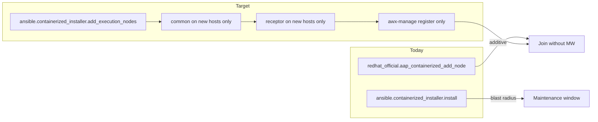

# Plan: fold additive EN/HN join into the containerized installer

Upstream-oriented design note. This collection (`redhat_official.aap_containerized_add_node`) is a **reference implementation** of additive execution/hop node join for containerized AAP. The long-term home for that capability should be the **containerized installer** (`ansible.containerized_installer` in the containerized setup tree).

**Scope: containerized installer only.** RPM and OpenShift are out of scope for this migration.

**Version targets**

| Priority | AAP / containerized setup | Notes |
|----------|---------------------------|--------|
| 1st | **2.7** | First installer landing target |
| 2nd | **2.6** | Backport / follow-on after 2.7 |
| Out of scope | **2.5** | Not planned for this installer migration |

This collection may still be used as a stopgap on 2.5/2.6 labs; the upstream playbook work should not block on 2.5.

**Working tree in this repo:** [installer-overlay/](installer-overlay/) mirrors `ansible.containerized_installer` paths so you can `rsync` into an extracted setup tree and run `ansible.containerized_installer.add_execution_nodes`. The Galaxy collection at the repo root remains the standalone reference. See [installer-overlay/README.md](installer-overlay/README.md).

Related: [docs/ARCHITECTURE.md](docs/ARCHITECTURE.md), [docs/FINDINGS.md](docs/FINDINGS.md), [docs/COLLECTION_MAP.md](docs/COLLECTION_MAP.md), [TEST.md](TEST.md).

## Thesis

Almost all join mechanics already live in `ansible.containerized_installer`. This collection exists because **orchestration is missing**: there is no first-class playbook that runs **only** the EN/HN path.

Migration is a thin additive playbook plus small role extractionsits—not a rewrite of receptor, TLS, image load, or `awx-manage`.



---

## 1. Problem and goal

### Today

1. Admin adds hosts under `[execution_nodes]` in the containerized installer inventory (`receptor_type`, `receptor_peers`, etc.).
2. Admin re-runs the full install from the setup tree:

   ```bash
   ansible-playbook -i inventory ansible.containerized_installer.install
   ```

3. That playbook walks the **entire** platform: preflight, `common` on all groups, redis, gateway, controller, hub, EDA, receptor on controllers **and** all execution nodes, controller init, postinstall, and so on.
4. Config rewrites notify Restart handlers across the stack. Receptor on existing controllers is often rewritten (AIO `local-only` → `tcp-listener`, and/or auto-peering new ENs from controllers).
5. `automationcontroller` init re-runs migrate/provision/register and can **`deprovision_instance`** for DB hostnames missing from the current inventory.

That blast radius is why adding a node requires a maintenance window—even though the new host only needs host prep, receptor, and DB registration.

### Goal

Ship a first-class **add execution / hop nodes** path in the containerized installer that:

- Targets **net-new** (or incomplete) hosts only
- Prefers **outbound peer dial** (new node → existing hop/controller listener) so existing `receptor.conf` files stay untouched
- Reuses the **existing mesh CA** (no cluster CA regeneration)
- Runs `awx-manage` registration **without** full controller init or inventory-diff deprovision
- Avoids restarting gateway / controller / hub / EDA / redis

---

## 2. Reuse map (collection → containerized installer)

| Collection concern | Already in `ansible.containerized_installer` | Migration action |
|--------------------|----------------------------------------------|------------------|
| Host prep / images | `roles/common` (+ `images.yml`) | Call only on net-new hosts |
| Receptor install / TLS | `roles/receptor` | Call only on net-new hosts; reuse mesh CA |
| `awx-manage` register | `roles/automationcontroller/tasks/init.yml` | **Extract** EN/HN `provision_instance` → `add_receptor_address` → `register_peers` → `register_queue` into a dedicated task file; **exclude** migrate, preload, and **deprovision** |
| AIO listener flip | `receptor.conf.j2` `local-only` logic | Small dedicated task (same idea as this collection’s `enable_controller_listener`) |
| Discovery vs heartbeat | *(none)* | Thin tasks: `list_instances` + inventory diff |
| Cert mint on ansible control host | Installer signs on-node during full run | Prefer the installer’s on-node TLS path from `receptor`; drop control-host-side mint if redundant |
| Verify | *(none / UI)* | Optional `list_instances` assert at end of the additive playbook |

**Do not reimplement** in the installer: podman linger, bundle image copy/load, receptor containers/systemd, or the `provision_instance` CLI sequence—those already exist.

This collection’s `host_prep` and `install_receptor_node` are thin wrappers around `common` and `receptor` from `aap_setup_dir`. Upstream should call those roles directly.

---

## 3. Proposed installer shape

Same invocation style as greenfield install. Suggested collection playbook (name illustrative):

| Artifact | Purpose |
|----------|---------|
| `playbooks/add_execution_nodes.yml` in `ansible.containerized_installer` | Additive join only |
| Admin command | `ansible-playbook -i inventory ansible.containerized_installer.add_execution_nodes` |

Scaffold of these paths (for local drop-in / upstream drafting) lives in [installer-overlay/](installer-overlay/).

Greenfield (unchanged):

```bash
ansible-playbook -i inventory ansible.containerized_installer.install
```

Additive (proposed):

```bash
ansible-playbook -i inventory ansible.containerized_installer.add_execution_nodes
```

### Play order

1. **Preflight** — containerized inventory present; `automationcontroller[0]` reachable; controller task container running.
2. **Discover** — build dynamic group `execution_nodes_new`: hosts in `[execution_nodes]` that do **not** yet show a **heartbeat** in `awx-manage list_instances` (skip healthy; re-target provisioned-but-incomplete).
3. **AIO listener (optional)** — if controller receptor is still `local-only`, swap to `tcp-listener` and reload receptor on the controller only (needed for the first outbound peer into a single-node mesh).
4. **`import_role: common`** — hosts: `execution_nodes_new` only (images, linger, firewall as today).
5. **`import_role: receptor`** — hosts: `execution_nodes_new` only; sign/install against the **existing** mesh CA.
6. **Register** — on `automationcontroller[0]`, include the extracted EN/HN registration tasks for those hostnames only.
7. **Verify** — `list_instances`; document that capacity / `ansible-runner` version may lag a few minutes before instances go green.

### Inventory (unchanged model)

Source of truth remains the containerized installer inventory. Example peer topologies:

```ini
# EN dials controller (outbound)
[execution_nodes]
en-01.example.com ansible_host=... receptor_type=execution \
  receptor_peers='["controller.example.com"]' routable_hostname=en-01.example.com

# Hop dials controller; EN dials hop
[execution_nodes]
hn-01.example.com ansible_host=... receptor_type=hop \
  receptor_peers='["controller.example.com"]' routable_hostname=hn-01.example.com
en-01.example.com ansible_host=... receptor_type=execution \
  receptor_peers='["hn-01.example.com"]' routable_hostname=en-01.example.com
```

---

## 4. Required containerized installer code changes (minimal set)

1. **Split registration from full controller init**  
   Move EN/HN `awx-manage` steps out of (or behind a flag in) `automationcontroller/tasks/init.yml` so the additive playbook does not run migrate, preload, or inventory-diff **deprovision**.

2. **Peer policy for zero-downtime growth**  
   Prefer requiring `receptor_peers` on new nodes (outbound dial). Avoid the growth path that auto-adds new ENs to controller peer lists in `receptor/tasks/facts.yml`—that rewrites and restarts controller receptor. Document outbound dial as the supported additive topology.

3. **Host limiting**  
   Ensure the additive playbook never applies `common` / `receptor` to gateway, hub, EDA, redis, or existing controllers (except the optional AIO listener helper).

4. **Idempotency**  
   Same rule as this collection’s `discover_new_nodes`: heartbeat ⇒ skip; registered but no heartbeat ⇒ re-run join; `provision_instance` remains idempotent.

5. **Docs in the setup tree**  
   - Inventory examples (EN→controller, EN→hop→controller)  
   - Disk sizing for EE image load on new nodes (lab: ~9 GB roots failed on `ee-supported`; ≥32–64 GB recommended)  
   - Expect a short settle time before instances show green heartbeats / capacity

---

## 5. What disappears from this collection

Once upstream ships the additive playbook in the containerized installer:

| Collection piece | Fate |
|------------------|------|
| `playbooks/add_node.yml` flow | Maps 1:1 onto `ansible.containerized_installer.add_execution_nodes` |
| `host_prep` / `install_receptor_node` | Unnecessary wrappers around installer `common` / `receptor` |
| `register_instance` | Replaced by extracted installer register tasks |
| `fetch_or_mint_certs` (control-host mint) | Prefer on-node installer TLS; drop if redundant |
| `fetch_mesh_material` / `enable_controller_listener` | Fold into installer helper tasks or receptor role |
| `discover_new_nodes` / `list_instances` / `verify_mesh` | Thin installer tasks |
| `validate_setup_dir` | Unnecessary when running from the setup tree itself |
| Image-skip lab helpers | Optional installer extras or omit |

`redhat_official.aap_containerized_add_node` then becomes a thin compatibility shim or is retired. Keep it as the reference implementation until the containerized installer change merges and is validated.

---

## 6. Validation and upstream path

### Validation

Reuse scenarios from [TEST.md](TEST.md) against the **new containerized installer playbook** (not this collection), in version order:

1. **2.7** AIO — T-27 analogs of EN, HN, EN-VIA-HN, re-run, deprov-rejoin, **full-upgrade** (primary gate)
2. **2.7** multi-controller — after AIO is solid
3. **2.6** — same scenario set as follow-on / backport validation (lab: additive join + **T-26-AIO-FULL-UPGRADE** already passed on AIO)

| ID (2.6 lab refs; rename for 2.7 as needed) | Scenario |
|---------------------------------------------|----------|
| T-26-AIO-EN / T-27-AIO-EN | Execution → controller |
| T-26-AIO-HN / T-27-AIO-HN | Hop → controller |
| T-26-AIO-EN-VIA-HN / T-27-AIO-EN-VIA-HN | Hop + EN via hop (one run) |
| T-*-AIO-RERUN | Mid-join failure then re-run |
| T-*-AIO-DEPROV-REJOIN | Deprovision, rebuild, join again |
| T-26-AIO-FULL-UPGRADE / T-27-AIO-FULL-UPGRADE | Full `install` after collection- or overlay-added HN+EN (inventory list-form peers) |

Do **not** require 2.5 validation for installer merge.

### Upstream

1. Propose the design (this document) against `ansible.containerized_installer` for the **2.7** containerized setup release train first.
2. Land docs with the additive command alongside the existing install instructions:

   ```bash
   ansible-playbook -i inventory ansible.containerized_installer.add_execution_nodes
   ```

3. Backport or re-validate on **2.6** after 2.7.
4. Retire or archive this collection after parity is proven on the TEST.md matrix for the supported installer versions (2.7, then 2.6).

---

## 7. Non-goals

- **RPM installer** — out of scope; this plan targets containerized only.
- **Containerized AAP 2.5** — out of scope for this installer migration (2.7 first, then 2.6).
- **OpenShift** — already has UI install-bundle add-node.
- **Changing greenfield `ansible.containerized_installer.install` behavior** beyond not breaking it (full install remains the path for new clusters).
- **Automated deprovision / uninstall playbook** — optional later; manual `awx-manage deprovision_instance` remains sufficient initially.
- **Gateway OAuth / `ansible.controller.instance` registration** — the containerized installer already uses `awx-manage`; stay on that path.

---

## Summary

| | `ansible.containerized_installer.install` today | Target additive path |
|--|-----------------------------------------------|----------------------|
| Hosts touched | Entire inventory / stack | New EN/HN (+ optional controller listener) |
| Roles | Full platform | `common` + `receptor` + extracted register |
| Mesh CA | Part of full install flow | Reuse existing |
| Deprovision missing hosts | Yes (hazard on growth) | No |
| Maintenance window | Yes | Near-zero (outbound peers) |
| Admin command | `ansible-playbook -i inventory ansible.containerized_installer.install` | `ansible-playbook -i inventory ansible.containerized_installer.add_execution_nodes` |

The missing piece is not new join technology—it is a **narrow playbook and a clean split of registration from full controller init**. This collection proves the flow; the containerized installer should own it.
