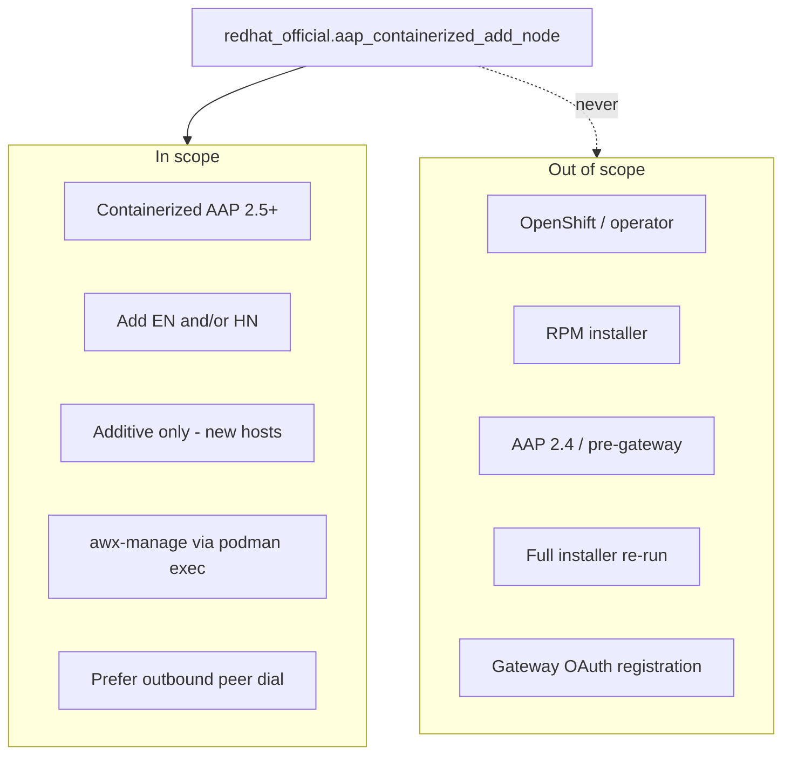
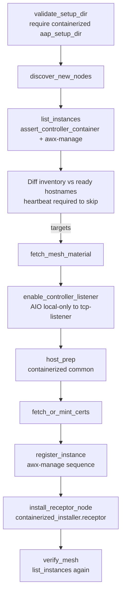
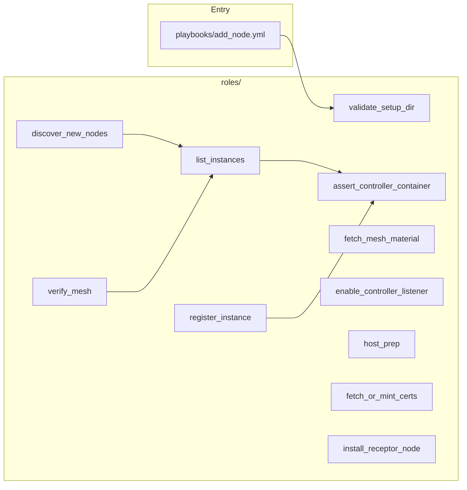
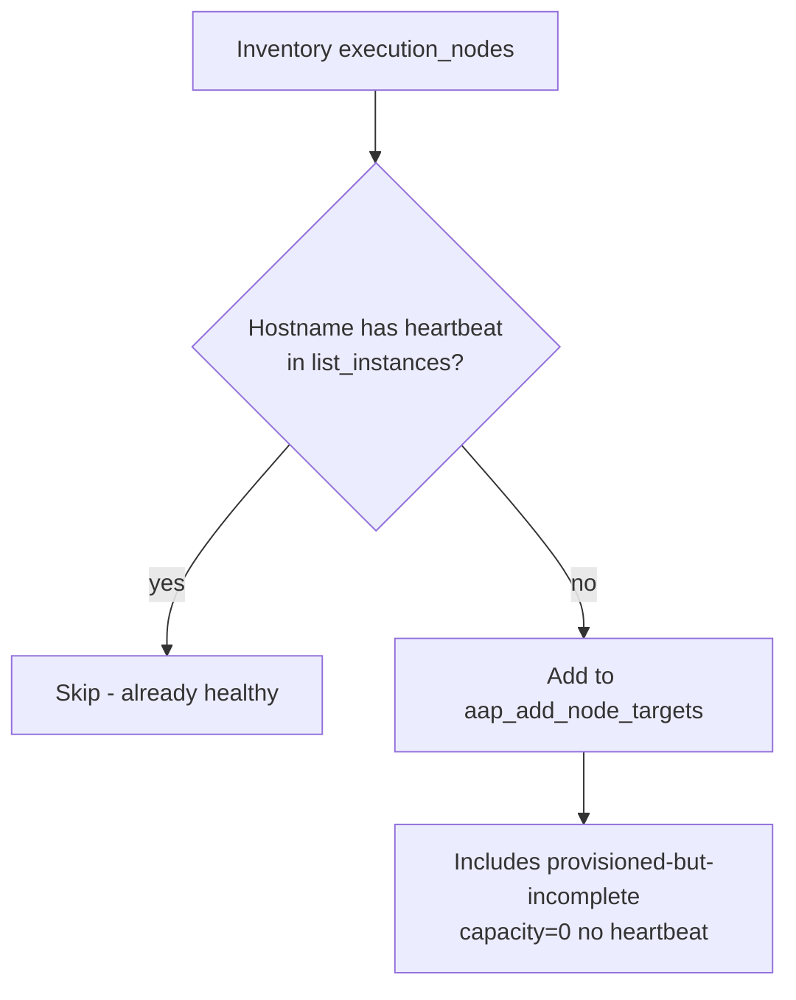
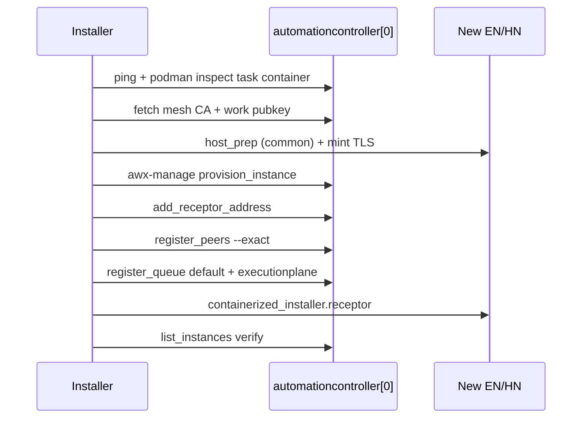

# Collection map — Mermaid

Current runtime map for **containerized AAP 2.5+**. See [ARCHITECTURE.md](ARCHITECTURE.md) for design, [TROUBLESHOOTING.md](TROUBLESHOOTING.md) for SSH/rollback, and [FINDINGS.md](FINDINGS.md) for historical installer research (RPM/OpenShift).

GitHub Mermaid notes: quote node labels that contain `[`, `]`, `{`, `}`, `/`, or `$`.

---

## 1. Scope

---

## 2. Playbook flow (`playbooks/add_node.yml`)

---

## 3. Roles

| Role | Purpose |
|------|---------|
| `validate_setup_dir` | Require `aap_setup_dir` with `ansible.containerized_installer`; reject RPM trees |
| `assert_controller_container` | SSH ping + `podman inspect` (task container running) |
| `list_instances` | `podman exec … awx-manage list_instances` (ANSI-stripped) |
| `discover_new_nodes` | Diff `[execution_nodes]` vs ready hostnames → `aap_add_node_targets` |
| `fetch_mesh_material` | Fetch mesh CA cert/key + work public key from controller `~/aap/…` |
| `enable_controller_listener` | Optional AIO: `local-only` → `tcp-listener` |
| `host_prep` | `ansible.containerized_installer.common` on new nodes |
| `fetch_or_mint_certs` | Mint node TLS with mesh CA on installer host |
| `register_instance` | `provision_instance` → `add_receptor_address` → `register_peers` → `register_queue` |
| `install_receptor_node` | `ansible.containerized_installer.receptor` + minted certs |
| `verify_mesh` | Re-check `list_instances` for new hostnames |

---

## 4. Controller HA

Always `groups['automationcontroller'][0]`. Any controller works (`awx-manage` → shared DB); `[0]` is a stable SSH/podman target. Mesh CA is expected on each controller under the install-user home.

---

## 5. Discovery skip rule

---

## 6. Register sequence

